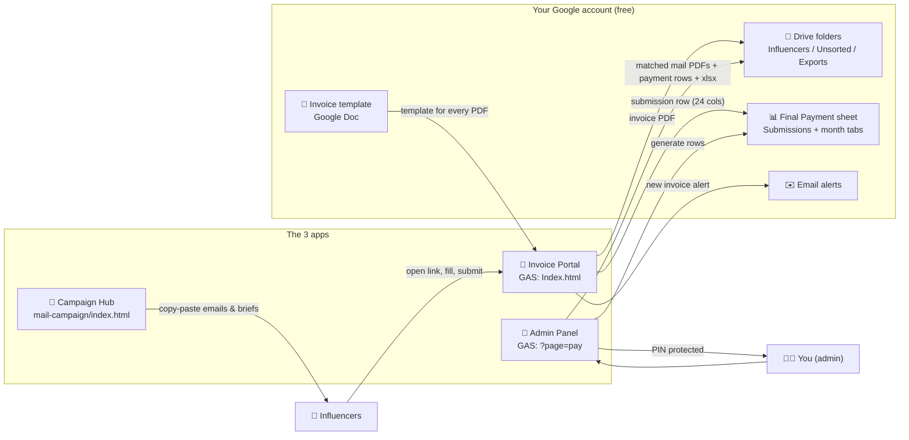
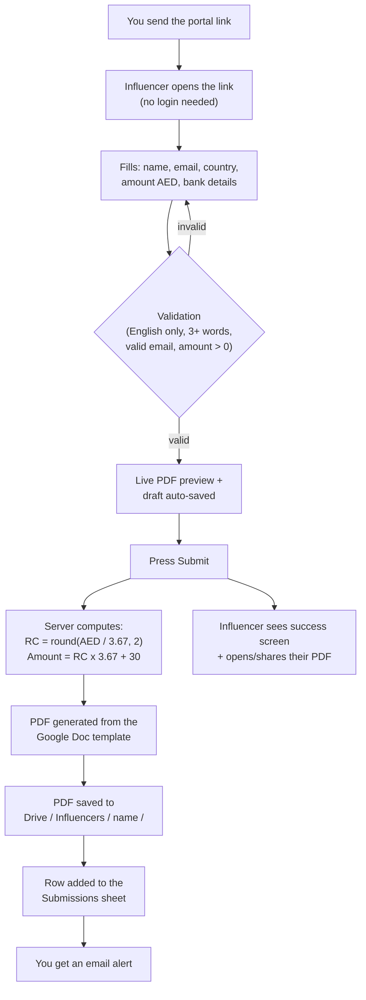
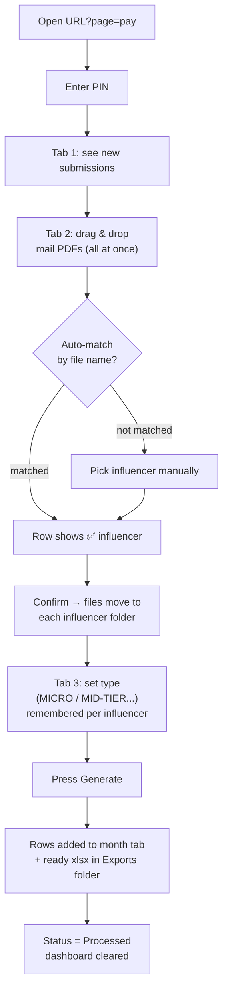
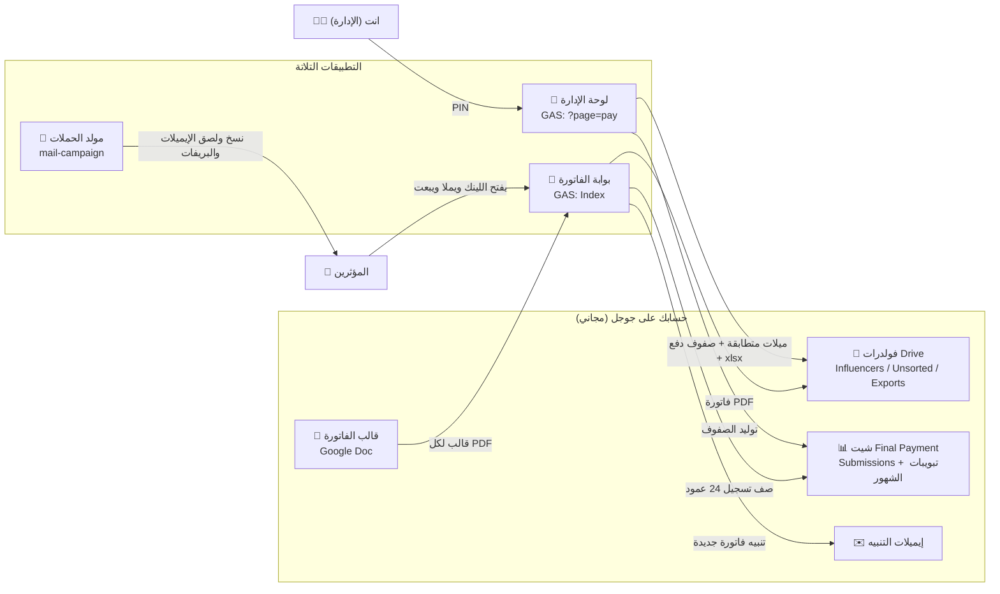
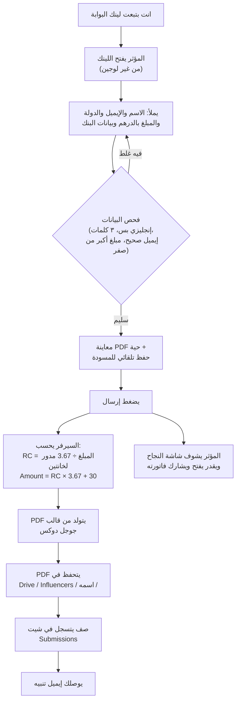
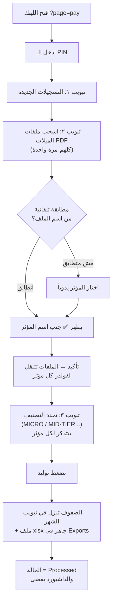

# Noon Ops Hub — Influencer Invoices, Payments & Campaigns

A 3-app system that runs the whole influencer operation on **Google Drive + Sheets + Apps Script** (free, your own account): influencers submit their invoices through a portal, and payment rows are generated into `Final Payment` exactly matching the July/August reference sheets.

> 🌐 **Language / اللغة:** English guide below — النسخة العربية في نفس الصفحة تحت، انزل لآخر الملف 👇

---

## 📦 What's inside

| App | What it does | Who uses it |
|---|---|---|
| `noon-payment-maker/gas/` | Influencer invoice portal (auto PDF → Drive + Sheet row) **and** the admin panel that generates payment rows | Influencers + You |
| `Noon-Invoice/index.html` | Offline backup invoice app (real .xlsx + PDF download) — works without Google | Influencers (if GAS is down) |
| `mail-campaign/index.html` | Unified email/brief generator + campaign manager for all months | You only |

- **Code is fully hidden** — all logic runs server-side on Apps Script; influencers only see a form.
- **Zero manual work**: no failed mobile downloads, no forgotten spreadsheets, no broken file names.

---

## 🗺️ Flowcharts — how everything works

### 1) System overview



### 2) Influencer journey — fully automatic



### 3) Your monthly routine — ~3 minutes



---

## 🛠️ Setup — one time only (~15 minutes)

1. **Move `Final Payment.xlsx` to Google Sheets** — create a Drive folder `Noon Payments`, upload the xlsx, open it → *File → Save as Google Sheets*. Copy the **Spreadsheet ID** from the URL.
2. **Copy the Drive folder ID** of `Noon Payments` from its URL.
3. **Create the script** — open [script.google.com](https://script.google.com) → New project → name it `Noon Ops Hub`.
4. **Copy the 7 files** from `noon-payment-maker/gas/` into the project (names must match **exactly**):

   | File | In Apps Script |
   |---|---|
   | `Code.gs` | replace the existing `Code.gs` content |
   | `Config.gs`, `InvoiceApi.gs`, `PaymentApi.gs`, `Setup.gs` | **+ → Script** with the same name |
   | `Index.html`, `Payment.html` | **+ → HTML** with the same name |

5. **Edit `Config.gs`** — only 3 values: `SPREADSHEET_ID`, `ROOT_FOLDER_ID`, `ADMIN_PIN` (also `NOTIFY_EMAILS` and `CAMPAIGNS` when a new month starts).
6. **Run `runSetup` once** from the editor (authorize when asked — it is your own script on your own account). It creates the `Submissions` tab, `Influencer Types` tab, Drive folders and the invoice Doc template.
7. **Deploy** → New deployment → Web app → *Execute as: Me* / *Access: Anyone* → copy the URL.

- Influencer portal = the deployment URL.
- Admin panel = same URL + `?page=pay`.
- Any code edit later: **Deploy → Manage deployments → ✏️ → New version** (URL stays the same).

---

## 🔍 The math — matches `Final Payment` exactly

- **RC $** = `round(Amount AED ÷ 3.67, 2)`
- **Amount in the payment sheet** = `RC$ × 3.67 + 30` (can show 4 decimals like `2628.2132` — same as the reference sheets)
- **Invoice grand total the influencer sees** = `Amount AED + 30`
- Account Number / IBAN / SWIFT are written **as text** (no more `3.44E+14`), mail/invoice/post links are clickable, column order A→T is identical to the reference.

---

## 🧪 Test everything yourself

**Without Google (right now, offline):**
1. Double-click `mail-campaign/index.html` → switch campaigns, generate Email/Brief EN/AR, edit/duplicate/import campaigns.
2. Double-click `Noon-Invoice/index.html` → fill the form → download PDF + xlsx → open the xlsx and check the columns.
3. Open `noon-payment-maker/gas/Index.html` as a file → demo mode (form + preview work; submit is simulated).

**After deploying (full end-to-end, 5 minutes):**
1. **As an influencer** — open the portal link in an incognito window (or your phone), submit with **your own email** and test data → success screen appears.
2. Verify the automation: PDF landed in `Drive/Noon Payments/Influencers/<name>/`, a row exists in `Submissions`, and you received the email alert.
3. Submit again with the same email → the **same row updates** (no duplicates).
4. **As admin** — open `...exec?page=pay` → enter your PIN → you should see the submission.
5. Download one of your Gmail emails as a PDF, name it `FirstName - noon.com Mail - test.pdf`, drag & drop it in Tab 2 → it auto-matches ✅ → **Confirm** → status becomes *Mail Added*.
6. Tab 3 → choose the type → **Generate** → check the month tab: formula, text account numbers, clickable links; an xlsx lands in `Exports`.
7. Before going live, delete your test row(s) from `Submissions` (and the month tab) so real data starts clean.

---

## 🧯 Troubleshooting

| Problem | Fix |
|---|---|
| Influencer got "already submitted & processed" | Their invoice is already saved and processed — contact flow is intended |
| Forgot the PIN | Check/change `ADMIN_PIN` in `Config.gs` → deploy a **new version** |
| Config edit not appearing | Deploy → Manage deployments → ✏️ → **New version** |
| Mail didn't auto-match | Pick the influencer manually from the dropdown next to the file |
| Want to change the PDF design | Open the Drive doc `Noon Invoice Template (DO NOT DELETE)` and edit it — keep the `{{PLACEHOLDERS}}` |
| Mobile download issues (backup app) | Use the **Share** button — it opens the phone's native save/share sheet |

---

## 🔐 Security notes

- All business logic lives in Apps Script behind your Google account; the public page is a form only (PIN-gated admin).
- `Config.gs` is the only file you edit; never share your PIN.
- This repo **excludes** `noon-payment-maker/to use reference/` (real bank data) and `test/` — keep those local only.

---
---

# 🚀 دليل التشغيل الكامل — منظومة نون (الفواتير + الدفع + الحملات)

> اقرأ الدليل مرة واحدة وطبّق الخطوات بالترتيب — كل حاجة هتاخد منك وقت قصير، وبعد التركيب الشغل كله أوتوماتيك.

## 📦 إيه اللي جواه المنظومة؟

| المشروع | وظيفته | مين بيستخدمه |
|---|---|---|
| `noon-payment-maker/gas/` | فاتورة المؤثر + تسليم أوتوماتيك + صفحة الإدارة لتوليد صفوف الدفع | المؤثرين + انت |
| `Noon-Invoice/index.html` | نسخة احتياطية محلية (بنفس شكل الفاتورة) — شغالة بدون جوجل | المؤثرين (لو GAS وقع) |
| `mail-campaign/index.html` | مولد إيميلات وبريفات موحد + مدير حملات لكل الشهور | انت فقط |

**مفيش**: تحميلات فاشلة من الموبايل، ناس تنسي الإكسيل، أسماء ملفات تتلخبط، أو كود ظاهر للناس — كل الحسابات والبيانات على سيرفر جوجل بحسابك.

## 🗺️ الـ Flowcharts — كل حاجة شغالة إزاي

### 1) نظرة عامة على المنظومة



### 2) رحلة المؤثر — أوتوماتيك بالكامل



### 3) روتينك الشهري — حوالي 3 دقايق



## 🛠️ التركيب — خطوة بخطوة (مرة واحدة فقط)

### الخطوة 1: انقل ملف Final Payment لـ Google Sheets

1. افتح [drive.google.com](https://drive.google.com) واعمل فولدر جديد اسمه `Noon Payments`
2. افتح الفولدر واسحب فيه ملف `Final Payment.xlsx`
3. اعمل عليه دبل كليك → هيفتح معاينة → من فوق اختار **فتح مع Google Sheets**
4. أول ما يفتح في Sheets: من قائمة **File → Save as Google Sheets** — هيظهر ملف Google Sheets جديد
5. افتح الملف الجديد وانسخ الـ **ID** من الرابط:
   ```
   https://docs.google.com/spreadsheets/d/【الـ ID هنا】/edit
   ```

### الخطوة 2: خد ID فولدر Drive

افتح فولدر `Noon Payments` وانسخ الـ ID من الرابط:
```
https://drive.google.com/drive/folders/【الـ ID هنا】
```

### الخطوة 3: أنشئ مشروع Apps Script

1. افتح [script.google.com](https://script.google.com) واضغط **New project**
2. من فوق سمّيه `Noon Ops Hub`

### الخطوة 4: انقل الملفات (Copy-Paste)

في `noon-payment-maker/gas/` هتلاقي 5 ملفات `.gs` وملفين `.html`:

| الملف | تعمله إيه في Apps Script |
|---|---|
| `Code.gs` | الصقه بدل محتوى `Code.gs` الموجود |
| `Config.gs` | **+ → Script** باسم `Config` → الصق |
| `InvoiceApi.gs` | **+ → Script** باسم `InvoiceApi` → الصق |
| `PaymentApi.gs` | **+ → Script** باسم `PaymentApi` → الصق |
| `Setup.gs` | **+ → Script** باسم `Setup` → الصق |
| `Index.html` | **+ → HTML** باسم `Index` → الصق |
| `Payment.html` | **+ → HTML** باسم `Payment` → الصق |

> ⚠️ **مهم جداً**: أسماء الملفات لازم تكون **بالظبط** زي اللي فوق (حروف كبيرة وصغيرة).

### الخطوة 5: عدّل ملف Config.gs

غيّر بس التلاتة دول:

```js
SPREADSHEET_ID: 'الصق هنا ID الشيت من الخطوة 1',
ROOT_FOLDER_ID: 'الصق هنا ID الفولدر من الخطوة 2',
ADMIN_PIN: 'غيّرها لرمز سري جديد (أرقام)',
```

- 📧 لو عايز تنبيهات على إيميل تاني: عدّل `NOTIFY_EMAILS`
- 📅 حملة الشهر الجديد: انسخ بلوك الحملة في `CAMPAIGNS` وغيّر البيانات وخلي `active: true` للحملة الشغالة بس

### الخطوة 6: شغّل الإعداد الأولي

1. من قائمة الدوال فوق اختار **runSetup** واضغط **Run**
2. أول مرة هيطلب **Authorize** — Review permissions → حسابك → Advanced → Go to Noon Ops Hub (unsafe) → Allow
   (ده طبيعي 100% — بتدي صلاحية لسكريبتك **انت** يفتح شيتك وفولدرك)
3. لو ظهرت رسالة فيها ✅✅✅ — التركيب خلص

### الخطوة 7: انشر التطبيق (Deploy)

1. **Deploy → New deployment** → ⚙️ → **Web app**
2. الإعدادات: **Execute as: Me** — **Who has access: Anyone** (ضروري عشان المؤثرين يفتحوه من غير لوجين)
3. اضغط **Deploy** وانسخ الرابط — **ده لينك الفاتورة للمؤثرين**

🔗 **لينك الإدارة** = نفس الرابط + `?page=pay`:
```
https://script.google.com/macros/s/XXXX/exec?page=pay
```

> 💡 حط لينك الفاتورة في الإيميلات، ولينك الإدارة احفظه في المتصفح عندك بس.
> 🔁 أي تعديل في الكود بعدين: **Deploy → Manage deployments → ✏️ → Version: New version** — الرابط بيفضل زي ما هو.

## 📅 روتينك الشهري (بعد التركيب)

**أول الشهر — تحضير الحملة:** افتح مولد الحملات → كرر حملة الشهر اللي فات → عدّل بياناتها → ولّد الإيميل والبريف وابعتهم → حدّث `CAMPAIGNS` في Config (الجديدة `active: true` والقديمة `false`).

**خلال الشهر — الفواتير (صفر مجهود):** المؤثرين بيقدموا بنفسهم وبتوصلك تنبيهات.

**آخر الشهر — صفوف الدفع (3 دقايق):** لينك الإدارة → PIN → ارفع الميلات (تتطابق تلقائياً) → تأكيد → التوليد → الصفوف في شيت الشهر + Excel في Exports.

## 🔍 المعادلات والتحقق

- **RC $** = قيمة الحملة ÷ 3.67 مدوّرة لخانتين عشريتين
- **Amount في شيت الدفع** = RC$ × 3.67 + 30 (ممكن 4 كسور زي 2628.2132 — نفس المرجع بالظبط)
- **إجمالي فاتورة المؤثر** = قيمة الحملة + 30
- أعمدة الحسابات بتتكتب **كنص** — مش هتتحول لـ 3.44E+14
- اللينكات (الميل / الفاتورة / البوستات) كليكابل في الشيت مباشرة
- ترتيب الأعمدة A→T زي ملف يوليو وأغسطس حرفياً

## 🧪 اجرب بنفسك — خطوة بخطوة

**من غير جوجل (دلوقتي حالاً):**
1. افتح `mail-campaign/index.html` بدبل كليك → بدّل بين الحملات، ولّد إيميل وبريف بالعربي والإنجليزي، جرب التعديل والتكرار والاستيراد
2. افتح `Noon-Invoice/index.html` → املأ الفورم → نزّل PDF وxlsx → افتح الإكسيل وشوف الأعمدة والأرقام
3. افتح `noon-payment-maker/gas/Index.html` كملف → وضع تجريبي (الفورم والمعاينة شغالين)

**بعد الـ Deploy (تجربة كاملة حقيقية — 5 دقايق):**
1. **بصفتك مؤثر**: افتح لينك البوابة في نافذة متخفية أو من موبايلك، وابعث فاتورة **بإيميلك الحقيقي** وبيانات تجريبية → هتشوف شاشة النجاح
2. اتأكد من الأوتوماتيك: الـ PDF نزل في `Influencers/اسم المؤثر/` + صف ظهر في `Submissions` + إيميل التنبيه وصل
3. ابعت تاني بنفس الإيميل → **نفس الصف بيتحدث** (مفيش تكرار)
4. **بصفتك إدارة**: افتح `...exec?page=pay` → ادخل الـ PIN → هتلاقي التسجيل ظاهر
5. نزّل إيميل من الجيميل كملف PDF وسمّيه `الاسم الأول - noon.com Mail - test.pdf` واسحبه في تبويب رفع الميلات → هيتطابق ✅ → اضغط تأكيد → الحالة تبقى *Mail Added*
6. تبويب التوليد → اختار التصنيف → **توليد** → افتح تبويب الشهر وشوف المعادلة واللينكات، وهتلاقي ملف Excel في Exports
7. قبل الشغل الحقيقي: امسح صفوف التجربة من `Submissions` وتبويب الشهر عشان البيانات الحقيقية تبدأ نضيفة

## 🧯 لو حصلت مشكلة

| المشكلة | الحل |
|---|---|
| المؤثر جرب يبعت وطلعله خطأ | خليه يعمل Refresh ويجرب تاني. لو اترسم "هذا الإيميل مسجّل بالفعل" — يعني فاتورته اتحفظت خلاص |
| نسيت الـ PIN | افتح `Config.gs` وشوفه/غيّره واعمل Deploy → Manage deployments → Edit → New version |
| عدّلت Config والحملة مش ظاهرة | لازم **Deploy → Manage deployments → ✏️ → New version** (أي تعديل محتاج نسخة جديدة) |
| الميل مش اتطابق بمؤثر | عادي — من القائمة اللي جنب الملف اختار المؤثر يدوياً واضغط تأكيد |
| عايز تعدل شكل الفاتورة PDF | من Drive افتح "Noon Invoice Template (DO NOT DELETE)" وعدّل — الـ {{...}} هي البيانات الأوتوماتيكية متشيلهاش |
| التحميل المحلي مش شغال على موبايل | استخدم زر المشاركة — بيفتح قايمة الموبايل نفسها، دي أضمن طريقة على iOS/أندرويد |

## 📁 ملاحظات على الملفات

- ملفات الشهور القديمة اتنقلت لـ `mail-campaign/archive/` — محفوظة، وبيانات أبريل وأغسطس جوه المولد الموحد.
- `Noon-Invoice/index.html` = نسخة احتياطية كاملة — ممكن تتنشر على Vercel لو GAS وقع، بس مش هتخزن في Drive ولا الشيت.
- فولدر `to use reference` وفولدر `test` **مش مرفوعين على جيت هاب** (فيهم بيانات بنوك حقيقية) — موجودين عندك محلياً بس.
